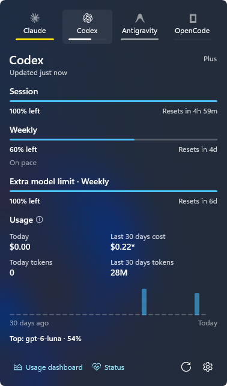

<p align="center">
  
</p>

<h1 align="center">Ration</h1>

<p align="center">AI coding quotas in your Windows tray.</p>

<p align="center"><b>English</b> · <a href="README.tr.md">Türkçe</a></p>

<p align="center">
  
</p>

## Features

- Session and weekly quota left, with reset times and a pace hint
- Tray icon that fills with your remaining quota
- Token and cost totals for the last 30 days from local logs
- Notifications when a quota drops below 20% and when it runs out
- Light and dark theme, English and Turkish

## Providers

Claude Code · Codex · Antigravity · OpenCode

## Install

Download `Ration-win-x64-Setup.exe` or the portable zip from [Releases](https://github.com/ozkancirak/Ration/releases). Requires Windows 10 1809 or later; designed for Windows 11. Unsigned builds may trigger a SmartScreen warning.

## Privacy

Credential files are read-only. No telemetry. Quota requests go straight to each provider's own endpoint, and responses are redacted before anything is logged.

## Development

```powershell
dotnet build Ration.slnx
dotnet test tests\Ration.Tests
dotnet run --project src\Ration.Cli -- usage -p all
powershell -ExecutionPolicy Bypass -File scripts\package.ps1
```

Log file: `%LOCALAPPDATA%\Ration\ration.log`.

## License

MIT. Provider marks from [Simple Icons](https://simpleicons.org) (CC0), [lobe-icons](https://github.com/lobehub/lobe-icons) (MIT) and the official OpenAI logo.
