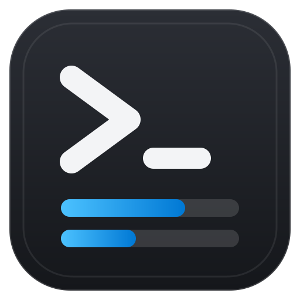
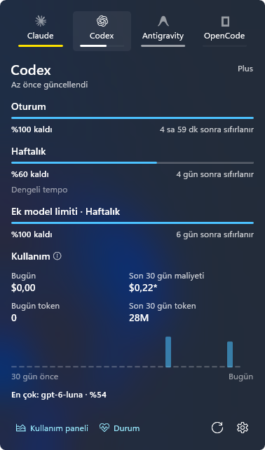

<p align="center">
  
</p>

<h1 align="center">Ration</h1>

<p align="center">AI quota in your Windows tray</p>

Ration, Windows 11 görev çubuğunda AI kodlama sağlayıcılarının kota kullanımını, sıfırlanma zamanlarını ve yerel token/maliyet özetlerini gösteren native bir tepsi uygulamasıdır.



Tepsi ikonu kalan kotayı dolgu olarak gösterir: [ikon matrisi](docs/screenshots/tray-contact-sheet.png).

## Desteklenen sağlayıcılar

- Claude Code
- Codex CLI
- Antigravity
- OpenCode

Ration, bu sağlayıcıların yerel kimlik dosyalarını salt okunur açar. Kaynak dosyalara token yenileme veya başka bir yazma işlemi yapmaz.

## Kurulum

Yayın paketinden `Ration-win-x64-Setup.exe` dosyasını çalıştırın. Taşınabilir kullanım için `Ration-win-x64-Portable.zip` arşivini açıp `Ration.exe` dosyasını çalıştırabilirsiniz.

Paket self-contained Windows App SDK içerir; temiz makinede ayrıca Windows App SDK runtime kurulması gerekmez. Yayın imzalanmamışsa Windows SmartScreen uyarısı görülebilir; bu, runtime veya sertifika kurulumu gerektirdiği anlamına gelmez.

## Gizlilik

Ration kendi telemetrisi veya kullanıcı kimlik verisini dışarı göndermez; kimlik dosyaları salt okunur. Kota göstergesi için gerekli istekler doğrudan ilgili sağlayıcının resmi endpoint'ine yapılır. Ham yanıtlar tanı günlüklerine yazılmadan önce redakte edilir.

## Güncelleme

Ayarlar içindeki **Güncellemeleri denetle** düğmesi GitHub Releases beslemesini kontrol eder. Ration otomatik indirme yapmaz; yeni sürüm bulunduğunda kullanıcı karar verir.

Varsayılan besleme `https://github.com/ozkancirak/Ration` adresidir. Yayın deposu farklıysa `RATION_UPDATE_REPOSITORY` ortam değişkeniyle değiştirilebilir.

## Geliştirme

```powershell
dotnet build Ration.slnx -c Debug
dotnet test tests\Ration.Tests\Ration.Tests.csproj
dotnet run --project src\Ration.Cli -- --selftest --screenshot-dir artifacts\selftest
powershell -ExecutionPolicy Bypass -File scripts\package.ps1 -Configuration Release
```

Paketleme `artifacts\release\releases` altında Setup.exe ve portable zip üretir. Tanı günlüğü `%LOCALAPPDATA%\Ration\ration.log` konumundadır; uygulamanın Ayarlar ekranındaki **Günlüğü aç** düğmesi bu dosyayı açar.

Sağlayıcı işaretleri Simple Icons (CC0) kaynaklarından yararlanır; teşekkürler.

İlk açılışta önceki ürünün ayar dosyaları (`theme.json`, `refresh.json`, varsa
`settings.json`) yalnızca yeni veri dizini henüz yoksa taşınır. Kota snapshot'ları
ve fiyat önbelleği yeniden oluşturulur. Eski başlangıç girdisi kaldırılır;
etkinse yeni sabit `%LOCALAPPDATA%\Ration\Ration.exe` yoluna geçirilir.

CLI derleme çıktısı `src\Ration.Cli\bin\Debug\net10.0-windows10.0.19041.0\ration.exe`
konumundadır. Örnek: `ration usage -p claude --json` ve `ration --log`.
Uygulama ve CLI ayrı çıktı dizinlerinde tutulur.
