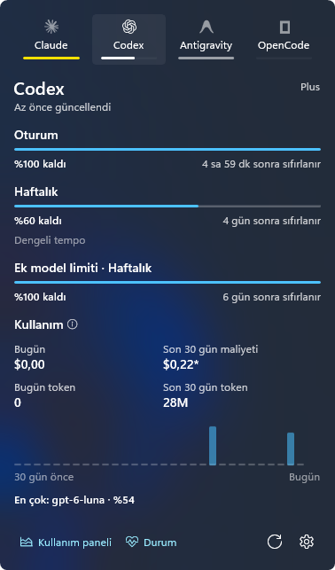

<p align="center">
  
</p>

<h1 align="center">Ration</h1>

<p align="center">Windows tepsisinde AI kodlama kotaların.</p>

<p align="center"><a href="README.md">English</a> · <b>Türkçe</b></p>

<p align="center">
  <a href="https://github.com/ozkancirak/Ration/releases/latest"></a>
  <a href="https://github.com/ozkancirak/Ration/actions/workflows/ci.yml"></a>
  
  <a href="LICENSE"></a>
</p>


<p align="center">
  
</p>

## Özellikler

- Oturum ve haftalık kalan kota, sıfırlanma zamanı ve tempo tahmini
- Kalan kotaya göre dolan tepsi ikonu
- Yerel loglardan son 30 günün token ve maliyet toplamı
- Kota %20'nin altına inince ve bitince bildirim
- Açık ve koyu tema; Türkçe ve İngilizce arayüz

## Sağlayıcılar

Claude Code · Codex · Antigravity · OpenCode

## Kurulum

[Releases](https://github.com/ozkancirak/Ration/releases) sayfasından `Ration-win-x64-Setup.exe` veya taşınabilir zip'i indir. Windows 10 1809 ve üstü gerekir; Windows 11 için tasarlandı. İmzasız sürümlerde SmartScreen uyarı verebilir.

### İndirmeyi doğrula

Her sürümde, dosyaların SHA-256 özetlerini listeleyen bir `SHA256SUMS.txt` bulunur. Kurulum dosyasının yanına indirip karşılaştır:

```powershell
Get-FileHash .\Ration-win-x64-Setup.exe -Algorithm SHA256
Select-String Setup .\SHA256SUMS.txt
```

İki özet aynı olmalı (PowerShell büyük, dosya küçük harfle yazar). Unix tarzı kabukta: `sha256sum -c SHA256SUMS.txt --ignore-missing`. Uygulama içi güncelleme kendi indirmelerini kendisi denetler; dosya elle yapılan indirmeler içindir.

## Gizlilik

Kimlik dosyaları salt okunur açılır. Telemetri yok. Kota istekleri doğrudan sağlayıcının kendi adresine gider; yanıtlar günlüğe yazılmadan önce maskelenir.

## Geliştirme

```powershell
dotnet build Ration.slnx
dotnet test tests\Ration.Tests
dotnet run --project src\Ration.Cli -- usage -p all
powershell -ExecutionPolicy Bypass -File scripts\package.ps1
```

Günlük dosyası: `%LOCALAPPDATA%\Ration\ration.log`.

Güncelleme yolunu GitHub'a çıkmadan denemek için iki sürümü `vpk pack` ile aynı klasöre paketle, eskisini kur ve `RATION_UPDATE_REPOSITORY` o klasörü gösterirken başlat.

## Lisans

MIT. Sağlayıcı işaretleri [Simple Icons](https://simpleicons.org) (CC0), [lobe-icons](https://github.com/lobehub/lobe-icons) (MIT) ve resmi OpenAI logosundan.
